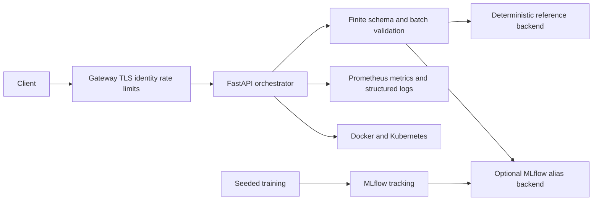

# ML Docker Orchestrator

[](https://github.com/CoreyLeath-code/ML-Docker-Orchestrator-with-full-MLops-pipeline/actions/workflows/ci.yml)
[](https://github.com/CoreyLeath-code/ML-Docker-Orchestrator-with-full-MLops-pipeline/actions/workflows/security.yml)


[](LICENSE)

A reproducible FastAPI inference service with an optional MLflow registry backend, Prometheus
telemetry, hardened containers, and evidence-producing CI/CD. The default reference backend mirrors
the seeded synthetic training function, so development, testing, benchmarks, readiness, and rollback
work without external infrastructure.

## Metrics dashboard

| Metric | Source of truth | Acceptance |
|---|---|---:|
| Core branch coverage | CI `coverage.xml` | >=90% |
| CI/security state | live workflow badges | all required jobs pass |
| Latency avg/median/p95/p99/min/max | `benchmarks/latest.json` | measured, hardware-sensitive |
| Throughput/success/peak memory | benchmark artifact | success = 100% |
| Synthetic RMSE/MAE/R2 | seeded benchmark | R2 > 0.95 regression test |
| Dependencies/licenses | `licenses.json` | inventory produced |
| Security findings | CodeQL, Bandit, pip-audit, Trivy | 0 blocking |
| Image/startup/API/model load | deployment-validation | all pass |
| SBOM | security evidence | SPDX JSON produced |
| Repository size/LOC/issues/releases | live GitHub metadata | not hard-coded |
| GPU/MAP/MRR/NDCG | not applicable/currently unavailable | never fabricated |

Numerical performance values stay attached to their commit and runner instead of becoming stale
README claims.

## Architecture



## Run and reproduce

```bash
python -m venv .venv
# activate the environment
python -m pip install -r requirements-dev.txt
pytest
python benchmarks/run_benchmark.py
uvicorn orchestrator.api:app --app-dir src --host 127.0.0.1 --port 8080
```

```bash
curl http://127.0.0.1:8080/ready
curl -X POST http://127.0.0.1:8080/predict \
  -H "content-type: application/json" \
  -d '{"records":[{"f1":1,"f2":2,"f3":3}]}'
```

Records require exactly finite numeric `f1`, `f2`, and `f3`; batches are bounded. Registry
failures return a sanitized 503. Set `MODEL_BACKEND=registry` only when MLflow, pandas, credentials,
network policy, and a promoted model alias are provisioned.

## Benchmark protocol

The benchmark warms the in-process API, measures the complete latency distribution, throughput,
success rate, peak Python allocation, and environment provenance, then regenerates seeded synthetic
RMSE, MAE, and R2. It is not a network capacity promise. Use k6 or Locust against staging for
1/10/100/1,000/10,000-user scenarios.

## Deployment

```bash
docker compose up --build
kubectl apply -f network-policy.yaml -f deployment.yaml -f service.yaml
```

The runtime uses UID 10001, read-only filesystems, dropped capabilities, RuntimeDefault seccomp,
resource bounds, disabled service-account tokens, immutable image tags, three probe types, and
default-deny networking. Nine gates cover formatting, lint, static analysis, tests, integration,
coverage, security, benchmark evidence, and production validation.

## Documentation

- [Audit](docs/AUDIT.md)
- [Architecture](docs/ARCHITECTURE.md)
- [Benchmark report](benchmarks/benchmark_report.md)
- [Performance](docs/PERFORMANCE.md)
- [Deployment and rollback](docs/DEPLOYMENT.md)
- [Production checklist](docs/PRODUCTION_CHECKLIST.md)
- [Security](SECURITY.md)
- [Contributing](CONTRIBUTING.md)
- [Code of Conduct](CODE_OF_CONDUCT.md)

## License

MIT. See [LICENSE](LICENSE).
