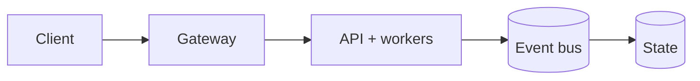

ML-Docker-Orchestrator with Full MLops Pipeline

# ⚙️ MLOps Docker Orchestrator with Full MLOps Pipeline


An enterprise-grade, highly available, and idempotent distributed MLOps orchestration platform. This platform programmatically schedules execution graphs (DAGs), tracks multi-container container life cycles, enforces strict image-layer vulnerability validation boundaries, and exposes an integrated AIOps Control Plane telemetry monitor.

---


## Production Readiness Guide

> This section is the portfolio audit entry point for **ML-Docker-Orchestrator-with-full-MLops-pipeline**. It describes an engineering promotion path; it is not a claim that the repository is already production-authorized.

[](https://github.com/CoreyLeath-code/ML-Docker-Orchestrator-with-full-MLops-pipeline/actions) [](https://github.com/CoreyLeath-code/ML-Docker-Orchestrator-with-full-MLops-pipeline/blob/main/LICENSE)

### Architecture flowchart



### Quickstart and local validation

The supported local path should be reproducible from a clean checkout. The inferred stack for this repository is **Python/platform services**.

```bash
python -m venv .venv && source .venv/bin/activate && pip install -r requirements.txt
pytest -q
```

If the project uses external services, model artifacts, cloud credentials, or private data, start them through documented local fixtures or mocks. Never place secrets or identifiable records in the repository.

### Research-style metrics and benchmarks

| Evidence | Required record |
|---|---|
| Correctness | Test command, commit SHA, runtime, and pass/fail result |
| Performance | Warm-up, sample count, concurrency, median, p95, p99, throughput, and memory |
| Data/model quality | Dataset version, split strategy, leakage controls, calibration, subgroup results, and uncertainty |
| Runtime | Image digest, health-check latency, resource limits, and rollback target |
| Security | Dependency, secret, SAST, container, and SBOM results |

A benchmark number belongs in a versioned artifact tied to a commit and hardware/runtime description. Engineering benchmarks must not be presented as clinical, financial, safety, or model-quality validation without the appropriate domain evidence.

### Extended Q&A

**What is production-ready for this repository?**  
A reproducible build, tested public contract, controlled configuration, observable runtime, documented security boundary, versioned artifacts, and a tested rollback path.

**What must remain explicit?**  
The intended use, excluded use, data/credential handling, model or algorithm limitations, and which metrics are measured versus aspirational.

**What should be completed next?**  
Use the linked production-readiness issue for this repository as the checklist. Resolve missing tests, deployment instructions, observability, supply-chain controls, and release evidence before attaching a production claim.


## ⚡ High-Availability Key Features

* **Idempotent Desired-State Enforcement:** Modeled on advanced Infrastructure-as-Code (IaC) paradigms to guarantee that container cluster definitions converge cleanly to the target state without data degradation or drift.
* **Deterministic Execution Scheduling (DAG):** Manages processing tasks sequentially across custom-bridged networks to ensure complete network isolation and data separation.
* **Production-Grade SecOps & Lineage:** Integrates automated multi-stage compilation caches, Software Bill of Materials (SBOM) tree generation, and automated container file vulnerability scanning via Trivy.
* **Integrated Telemetry Control Plane:** Built with an active Streamlit monitoring grid that maps distributed component health, tracks system logs, and exposes interactive hook engines to test fault-tolerant chaos engineering scenarios.

---

## 🗺️ Platform Architecture & Distributed Topology

graph LR
    A[Idle] --> B[Data Ingestion]
    B --> C[Feature Validation]
    C --> D[Model Training]
    D --> E[Image Compilation]
    E --> F[Registry Promotion]
    F --> A
    
The system operates inside an isolated Docker bridge network environment, decoupling high-throughput orchestration processing layers from active UI data visualizers.


Architecture Flow


🗺️ Platform Architecture & Distributed Topology

The system operates inside an isolated Docker bridge network environment, decoupling high-throughput orchestration processing layers from active UI data visualizers.

   [ Client / Engineering Operator ]
                   │
                   ▼ (Maps Ingress Port 8501)
 ┌────────────────────────────────────┐
 │ mlops_control_plane (Streamlit UI) │ ◄── Telemetry Control Engine
 └─────────────────┬──────────────────┘
                   │
 ⚙️  [ mlops-network ] (Isolated Internal Docker Bridge)
                   │
┌──────────────────┼──────────────────┐
│                  │                  │
┌──▼──┐            ┌──▼──┐            ┌──▼──┐
│Job 1│            │Job 2│            │Job 3│ ◄── MLOps Worker Core Nodes
└─────┘            └─────┘            └─────┘


### Execution Lifecycles (State Machine Transition Graph)
1. **Data Ingestion Node:** Triggers disk serialization and local cache validation profiles.
2. **Feature Validation Node:** Run statistical drift checking routines ($O(1)$ lookup verification).
3. **Model Training Node:** Pulls deterministic parameter matrices into local runtime environments.
4. **Image Compilation Node:** Compiles hardened output components inside isolated Docker environments.
5. **Registry Promotion Node:** Runs automated vulnerability signature checking and promotes to release boundaries.

---

## ⚙️ Project Structure & Component Matrix

```text
├── .github/workflows/
│   └── ci.yml               # Automated multi-stage builds, Trivy CVE scanning, & SBOM audits
├── Dockerfile.monitor       # Multi-stage, layer-optimized runtime definition for the Control Plane
├── docker-compose.yml       # Primary multi-container cluster topology specification
├── platform_monitor.py      # Streamlit AIOps telemetry control engine and chaos simulation script
├── requirements.txt         # Enforced base platform dependencies pinned to stable builds
└── README.md                # L6 System Documentation


Metrics Table
Metric	Description	Purpose
ml_api_requests_total	Total API requests	Traffic monitoring
ml_prediction_latency_seconds	Inference latency	Performance tracking
model_version	Active model version	Traceability
experiment_id	MLflow run ID	Reproducibility
deployment_replicas	Active pods	Scaling insight


Quick Start
Clone Repository
git clone https://github.com/Trojan3877/ML-Docker-Orchestrator-with-full-MLops-pipeline.git
cd ML-Docker-Orchestrator-with-full-MLops-pipeline
Create Environment
python -m venv venv
source venv/bin/activate
pip install -r requirements.txt
 Run API
uvicorn api.main:app --reload


http://localhost:8000/docs
 Docker Run
docker build -t ml-orchestrator .
docker run -p 8000:8000 ml-orchestrator
 Kubernetes Deploy
kubectl apply -f orchestration/kubernetes/deployment.yaml
Metrics Table
Metric	Description	Purpose
ml_api_requests_total	Total API requests	Traffic monitoring
ml_prediction_latency_seconds	Inference latency	Performance tracking
model_version	Active model version	Traceability
experiment_id	MLflow run ID	Reproducibility
deployment_replicas	Active pods	Scaling insight
Enterprise Capabilities Demonstrated

Decoupled training and inference pipelines

Reproducible experiment tracking

Container-first deployment model

Infrastructure as Code (Terraform-ready)

Horizontal scalability via Kubernetes

Observability-first design

CI/CD-driven validation


Q1: How does this system handle model versioning?

Model artifacts are logged via MLflow and can be promoted to production through registry integration. Deployment is decoupled from training, allowing safe model upgrades.

Q2: How is inference latency controlled?

Model caching at startup

Prometheus latency monitoring

Container resource constraints

Horizontal pod scaling

Q3: How would you scale this for millions of requests?

Add API gateway layer

Implement Redis caching

Use autoscaling (HPA)

Add load balancing

Deploy on managed Kubernetes (EKS/GKE)

Q4: How is reproducibility ensured?

MLflow tracking URI

Logged hyperparameters

Artifact versioning

Environment config isolation

Q5: How would you integrate GPU support?

Use CUDA-enabled Docker base image

Kubernetes node selector for GPU nodes

Torch/TensorFlow GPU runtime

Q6: How would you improve fault tolerance?

Readiness and liveness probes

Circuit breaker pattern

Request timeouts

Graceful shutdown hooks

Q7: What makes this enterprise-grade?

Config-driven architecture

CI/CD validation

Observability integration

Decoupled pipelines

Infrastructure modularity

Production-style container builds

Why This Project Matters
https://ml-docker-orchestrator-with-full-mlops-pipeline-e75dgnyebvnqxp.streamlit.app/ LIVE DEMO LINK
This repository demonstrates:
Practical MLOps understanding
Infrastructure fluency
Production API design
DevOps integration
System design thinking
It is not a toy ML project.
It is an infrastructure-oriented ML platform.
