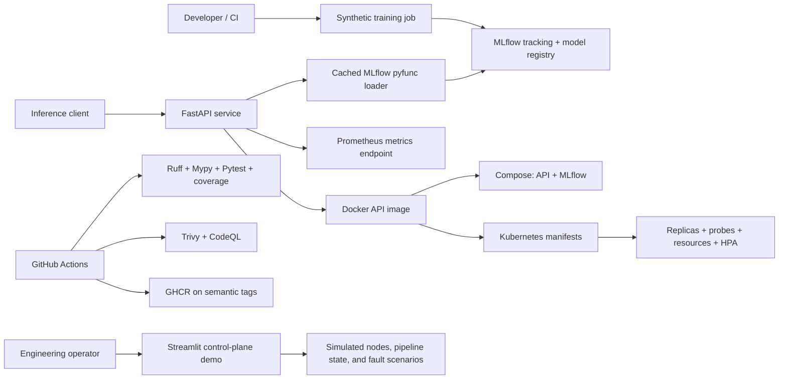
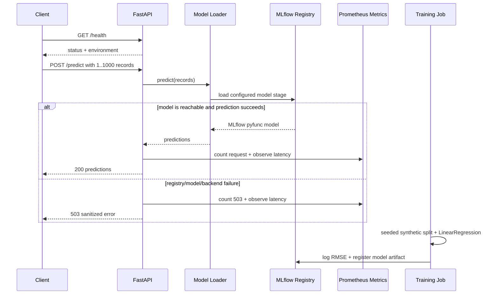

# ⚙️ ML Docker Orchestrator — MLOps Reference Platform

[](https://github.com/CoreyLeath-code/ML-Docker-Orchestrator-with-full-MLops-pipeline/actions/workflows/ci.yml)
[](https://github.com/CoreyLeath-code/ML-Docker-Orchestrator-with-full-MLops-pipeline/actions/workflows/security.yml)
[](https://github.com/CoreyLeath-code/ML-Docker-Orchestrator-with-full-MLops-pipeline/actions/workflows/codeql.yml)
[](https://github.com/CoreyLeath-code/ML-Docker-Orchestrator-with-full-MLops-pipeline/actions/workflows/release.yml)
[](https://github.com/CoreyLeath-code/ML-Docker-Orchestrator-with-full-MLops-pipeline/actions/workflows/cd.yml)
[](pyproject.toml)
[](pyproject.toml)
[](LICENSE)

A **production-shaped MLOps reference implementation** for model training, MLflow-backed model loading, FastAPI inference, Prometheus instrumentation, container packaging, Kubernetes deployment assets, CI/security automation, and a Streamlit control-plane demonstration.

> **Evidence boundary:** this repository contains real API, MLflow, CI, security, container, and deployment code, but it is **not a production-certified container orchestrator**. The Streamlit control plane simulates node state, pipeline transitions, failure injection, CPU/memory values, throughput, and replica counts for demonstration purposes. No README metric below is presented as a measured production SLO.

The strongest defensible portfolio story is **MLOps systems engineering and deployment architecture**, not a claim of a custom Kubernetes/Docker scheduler. See [`L6_AUDIT.md`](L6_AUDIT.md) for the staff-level promotion audit.

---

## What this repository actually demonstrates

- **FastAPI inference contract** with `/health`, `/metrics`, and `/predict` endpoints.
- **Bounded request validation** for prediction batches from 1 to 1,000 records.
- **Sanitized failure behavior** that returns HTTP `503` instead of leaking backend exception details.
- **MLflow Model Registry integration** through a cached `mlflow.pyfunc` model loader.
- **Reproducible synthetic training path** using NumPy seed `42`, a fixed train/test split, linear regression, RMSE logging, and MLflow model registration.
- **Prometheus instrumentation** for request counts and request-latency histograms.
- **Docker packaging** for the API and a Docker Compose environment containing MLflow + API services.
- **Kubernetes deployment assets** including replicas, health probes, resource requests/limits, HPA, NetworkPolicy, Service, ConfigMap, and ServiceMonitor manifests.
- **Infrastructure scaffolding** for Terraform and Ansible.
- **CI quality controls** using Ruff, Mypy, Pytest, and coverage enforcement.
- **Security automation** with Trivy, CodeQL, Dependabot, and dependency review.
- **Tag-driven GHCR publication** plus a semantic-release workflow.
- **Streamlit architecture demo** for simulated pipeline/node-state visualization and failure scenarios.

---

## Evidence snapshot

This table distinguishes committed implementation from claims that still require measurement or integration evidence.

| Surface | Committed evidence | Current boundary |
|---|---|---|
| API | `/health`, `/metrics`, `/predict` in `src/orchestrator/api.py` | no authentication, rate limiting, or load-test evidence |
| Input safety | batch size constrained to 1–1,000 records | feature schema is still generic `dict[str, Any]` |
| Failure handling | model errors are sanitized to HTTP `503` | no retry/circuit-breaker policy |
| Model serving | cached MLflow `pyfunc` load from configured model stage | requires reachable MLflow registry + promoted model |
| Training | seeded 500-row, 3-feature synthetic regression experiment | synthetic placeholder; no real-data generalization claim |
| Evaluation | RMSE logged during training | `evaluate.py` is still a placeholder for drift/fairness/gates |
| Tests | health, configuration, empty-batch, and sanitized-failure tests under `tests/` | no live MLflow, Docker, or Kubernetes integration tests |
| Coverage | `fail_under = 80` configured in `pyproject.toml` | threshold configuration is not a claim of a specific current percentage |
| Metrics | Prometheus counter + latency histogram | no committed P50/P95/P99/throughput benchmark artifact |
| Containers | API Dockerfile + Compose MLflow/API stack | runtime image currently runs as root and has no Docker `HEALTHCHECK` |
| Kubernetes | deployment, probes, resources, HPA, network policy, ServiceMonitor | manifests are not validated against a live ephemeral cluster in CI |
| Security | Trivy HIGH/CRITICAL filesystem scan + CodeQL | no release SBOM/provenance/signature evidence in the current CD workflow |
| Release | semantic-release on `main`; GHCR image build on `v*.*.*` tags | release and image publication are separate workflows |
| Control plane UI | Streamlit pipeline/node-state visualization | telemetry and chaos actions are simulated, not live Docker/K8s control |

---

## Architecture flowchart


```mermaid
flowchart LR
    Dev["Developer / CI"] --> Train["Synthetic training job"]
    Train --> MLflow["MLflow tracking + model registry"]

    Client["Inference client"] --> API["FastAPI service"]
    API --> Loader["Cached MLflow pyfunc loader"]
    Loader --> MLflow
    API --> Metrics["Prometheus metrics endpoint"]

    API --> Image["Docker API image"]
    Image --> Compose["Compose: API + MLflow"]
    Image --> K8s["Kubernetes manifests"]
    K8s --> Runtime["Replicas + probes + resources + HPA"]

    CI["GitHub Actions"] --> Quality["Ruff + Mypy + Pytest + coverage"]
    CI --> Security["Trivy + CodeQL"]
    CI --> Registry["GHCR on semantic tags"]

    Operator["Engineering operator"] --> Demo["Streamlit control-plane demo"]
    Demo --> Sim["Simulated nodes, pipeline state, and fault scenarios"]
```

### System design flow


```mermaid
sequenceDiagram
    participant Client
    participant API as FastAPI
    participant Loader as Model Loader
    participant Registry as MLflow Registry
    participant Metrics as Prometheus Metrics
    participant Trainer as Training Job

    Client->>API: GET /health
    API-->>Client: status + environment

    Client->>API: POST /predict with 1..1000 records
    API->>Loader: predict(records)
    Loader->>Registry: load configured model stage
    alt model is reachable and prediction succeeds
        Registry-->>Loader: MLflow pyfunc model
        Loader-->>API: predictions
        API->>Metrics: count request + observe latency
        API-->>Client: 200 predictions
    else registry/model/backend failure
        API->>Metrics: count 503 + observe latency
        API-->>Client: 503 sanitized error
    end

    Trainer->>Trainer: seeded synthetic split + LinearRegression
    Trainer->>Registry: log RMSE + register model artifact
```

---

## Quick Start

### Option A — Local API on Windows PowerShell

```powershell
git clone https://github.com/CoreyLeath-code/ML-Docker-Orchestrator-with-full-MLops-pipeline.git
cd ML-Docker-Orchestrator-with-full-MLops-pipeline

py -3.11 -m venv .venv
.\.venv\Scripts\Activate.ps1
python -m pip install --upgrade pip
pip install -e ".[dev]"

uvicorn orchestrator.api:app --host 127.0.0.1 --port 8080
```

In another PowerShell window:

```powershell
Invoke-RestMethod http://127.0.0.1:8080/health
Invoke-WebRequest http://127.0.0.1:8080/metrics
```

### Option B — Local API on Linux/macOS

```bash
git clone https://github.com/CoreyLeath-code/ML-Docker-Orchestrator-with-full-MLops-pipeline.git
cd ML-Docker-Orchestrator-with-full-MLops-pipeline

python3 -m venv .venv
source .venv/bin/activate
python -m pip install --upgrade pip
pip install -e ".[dev]"

uvicorn orchestrator.api:app --host 127.0.0.1 --port 8080
```

Verify:

```bash
curl http://127.0.0.1:8080/health
curl http://127.0.0.1:8080/metrics
```

### Option C — Docker Compose with MLflow

```bash
docker compose -f infra/docker-compose.yml up --build
```

Then verify:

```bash
curl http://127.0.0.1:8080/health
```

MLflow is exposed at `http://127.0.0.1:5000` and the API at `http://127.0.0.1:8080`.

> `/predict` requires a compatible model in the configured MLflow Registry stage. Starting the services alone does not create or promote that model.

### Option D — Streamlit demonstration

```bash
streamlit run platform_monitor.py
```

The existing hosted demo is linked here: [Streamlit control-plane demo](https://ml-docker-orchestrator-with-full-mlops-pipeline-e75dgnyebvnqxp.streamlit.app/).

The dashboard is intentionally a **simulation surface**. Its worker state, CPU/memory movement, scheduler latency, throughput, replica count, kill action, and reprovision action are not live cluster telemetry.

---

## Reproducibility and research-style evidence

### Training protocol

The canonical training module is `src/orchestrator/pipeline/train.py`.

Current protocol:

- NumPy RNG seed: `42`
- observations: `500`
- input features: `3`
- synthetic target: linear combination of the three features plus Gaussian noise
- test fraction: `20%`
- split seed: `42`
- estimator: `LinearRegression`
- reported training metric: RMSE
- experiment tracking: MLflow experiment `orchestrator-training`
- model registration target: configured `MODEL_NAME`

Run MLflow locally:

```bash
mlflow server \
  --host 127.0.0.1 \
  --port 5000 \
  --backend-store-uri sqlite:///mlflow.db \
  --default-artifact-root ./mlruns
```

Then, from another activated environment:

```bash
python -m orchestrator.pipeline.train
```

The training script prints its RMSE and records the run in MLflow. The exact RMSE should be treated as experiment output, not a production model-quality claim.

### CI-equivalent validation

```bash
ruff check .
ruff format --check .
mypy .
pytest --cov=src --cov-report=term-missing
```

`pyproject.toml` configures coverage to fail below `80%`. A future evidence upgrade should persist coverage XML, JUnit, benchmark JSON, environment metadata, and the tested commit SHA as CI artifacts.

---

## API contract

| Method | Endpoint | Purpose |
|---|---|---|
| `GET` | `/health` | service liveness and configured environment |
| `GET` | `/metrics` | Prometheus exposition when metrics are enabled |
| `POST` | `/predict` | bounded batch prediction through the MLflow-backed model loader |

Example request:

```bash
curl -X POST http://127.0.0.1:8080/predict \
  -H "Content-Type: application/json" \
  -d '{"records":[{"f1":1.0,"f2":2.0,"f3":3.0}]}'
```

If MLflow or the configured model is unavailable, the API deliberately returns a sanitized `503` response rather than exposing backend exception text.

---

## Deployment and infrastructure surface

### Docker

The canonical root `Dockerfile` packages `src/orchestrator` and serves the FastAPI application with Uvicorn on port `8080`.

```bash
docker build -t ml-docker-orchestrator:local .
docker run --rm -p 8080:8080 ml-docker-orchestrator:local
```

### Kubernetes

`infra/k8s/` contains:

- namespace and configuration resources;
- Deployment with two replicas;
- readiness and liveness probes;
- CPU/memory requests and limits;
- Service;
- HPA;
- NetworkPolicy;
- example Secret manifest;
- Prometheus `ServiceMonitor`.

The deployment image is currently a placeholder and must be replaced with an immutable registry reference before real deployment.

### Infrastructure foundations

The repository also contains Terraform and Ansible files. They demonstrate infrastructure layout and provisioning intent; they are not currently backed by an end-to-end ephemeral-environment CI validation.

---

## CI, security, and release contract

### CI

`.github/workflows/ci.yml` runs on pushes and pull requests to `main` and currently performs:

- Python 3.11 setup;
- dependency installation;
- Ruff checks for changed Python files;
- checkout mutation detection;
- Mypy analysis;
- Pytest with coverage over `src`.

### Security

The repository includes:

- Trivy filesystem scanning for HIGH/CRITICAL findings;
- CodeQL analysis;
- a separate CodeQL workflow;
- dependency review;
- Dependabot configuration.

A green workflow should be interpreted as **executed configured checks**, not proof that the system has zero vulnerabilities or a complete software-supply-chain policy.

### Releases and packages

Two distinct automation paths exist:

1. `release.yml` runs semantic-release on `main`.
2. `cd.yml` builds and publishes `ghcr.io/<owner>/ml-docker-orchestrator:<tag>` when a `v*.*.*` tag is pushed.

Promotion work should eventually unify release metadata, immutable image digests, SBOM/provenance, release notes, and verification into one traceable release contract.

---

## Extended Q&A

### Is this a production container orchestrator?

No. It is an MLOps reference platform with real FastAPI, MLflow, Docker, Kubernetes-manifest, CI, and security components. The Streamlit control plane is a simulation and does not issue live Docker or Kubernetes commands. See the [Scope and limitations](#scope-and-limitations) section before representing it as a deployed production system.

### Which application path is canonical?

Use `src/orchestrator/`. It contains the canonical FastAPI application, MLflow model loader, metrics instrumentation, and synthetic training workflow. The `app/` and `model/` directories are legacy PyTorch-serving material and should not be combined with the canonical runtime without an explicit migration plan.

### Which Python version should I use?

The package supports Python 3.10 or newer; CI validates with Python 3.11. For the closest local reproduction of CI, create a fresh Python 3.11 virtual environment and install the development extras:

```bash
python -m venv .venv
source .venv/bin/activate  # Windows PowerShell: .\.venv\Scripts\Activate.ps1
python -m pip install --upgrade pip
pip install -e ".[dev]"
```

### Why does `/health` succeed while `/predict` returns HTTP 503?

`/health` only establishes that the API process is reachable. `/predict` also needs a reachable MLflow service, a compatible registered model, and the configured model stage. Backend failures are intentionally returned as a sanitized HTTP 503, so the response does not reveal registry credentials, paths, or exception details.

### Does Docker Compose create and promote a model automatically?

No. `infra/docker-compose.yml` starts the API and MLflow services but does not train or promote a model. Start MLflow, run `python -m orchestrator.pipeline.train`, then promote a compatible model in MLflow to the stage selected by the application's configuration before calling `/predict`.

### How can I run the same quality gates as CI?

Run these commands from an activated development environment:

```bash
ruff check .
ruff format --check .
mypy .
pytest --cov=src --cov-report=term-missing
```

The configured coverage gate fails below 80%. A passing local result is useful evidence, but the pull-request checks remain the merge authority because they run from the exact pushed commit.

### What does the test suite cover today?

The committed tests cover the API health/configuration behavior, empty or invalid prediction-batch handling, and sanitized model-backend failures. They do not yet provide live MLflow, Docker Compose, Kubernetes, load, or recovery-drill coverage. Those gaps are intentional roadmap items, not claims of end-to-end production validation.

### Why did the Security workflow fail even though CodeQL passed?

The observed failure occurred before scanning: Trivy could not download its vulnerability database from `mirror.gcr.io` because the mirror returned HTTP 403. The workflow now pins Trivy to `v0.36.0` and requests the database from `public.ecr.aws/aquasecurity/trivy-db:2`. This fixes scanner availability without suppressing security findings; HIGH and CRITICAL findings still fail the job.

### What does a green security check prove?

It proves that the configured Trivy, CodeQL, and dependency-review checks executed successfully for that commit. It does not prove the absence of every vulnerability, replace runtime monitoring, or provide an SBOM, provenance attestation, signing policy, or complete supply-chain assurance.

### Why are release jobs skipped on ordinary pushes or pull requests?

That is expected. The repository separates normal CI from release automation. Semantic-release runs on `main`, while the GHCR image publication workflow runs when a semantic `v*.*.*` tag is pushed. A skipped tag-gated job is not a failed release; it means the event was not a release trigger.

### What artifact is currently published?

The release automation is configured to publish a container image to GitHub Container Registry (GHCR), using the `ghcr.io/<owner>/ml-docker-orchestrator:<tag>` naming pattern. It does not currently publish a Python package to PyPI. Before consuming a release, inspect its image digest and verify it is the intended immutable tag.

### Can I apply the Kubernetes manifests directly?

Treat them as deployment templates. First replace the placeholder image with an immutable, tested GHCR digest; create real secrets outside source control; validate the manifests against the target cluster; and confirm the ingress, monitoring, namespace, and NetworkPolicy assumptions. The repository does not yet run an ephemeral-cluster deployment test in CI.

### Where do I find metrics and what do they mean?

The API exposes Prometheus-format metrics at `GET /metrics`, including request count and latency-histogram instrumentation. They show behavior observed by the running process, not a published SLO. There is no committed P95/P99 throughput or latency benchmark artifact, so do not infer performance numbers from the dashboard simulation.

### Is the Streamlit dashboard connected to real infrastructure?

No. `platform_monitor.py` is a visual demonstration of pipeline transitions, node state, fault injection, resource movement, and replica changes. It is useful for communicating an operating model, but it is not live Kubernetes telemetry or an orchestration control plane.

### What should I change before a real production deployment?

At minimum: run the container as a non-root user; add a Docker health check; pin actions by immutable SHA; generate SBOM and provenance; use immutable image digests; add authentication, authorization, input-schema governance, and rate limiting; validate MLflow/Docker/Kubernetes integrations in CI; introduce real data/model-governance evidence; and run benchmark plus recovery-drill tests. The [L6 promotion priorities](#l6-promotion-priorities) provide the ordered roadmap.

---

## Evidence and reproducibility matrix

| Claim | Evidence | Reproduce / inspect | Boundary |
|---|---|---|---|
| API health contract | `src/orchestrator/api.py`, `tests/test_health.py` | `pytest tests/test_health.py -v` | liveness only |
| Bounded prediction input | Pydantic request model | `pytest tests/test_predict.py -v` | generic feature dictionaries |
| Sanitized backend failure | `tests/test_predict.py` | same test command | no retry/resilience proof |
| Prometheus instrumentation | `src/orchestrator/metrics.py` | `GET /metrics` | no SLO/benchmark artifact |
| MLflow model loading | `src/orchestrator/model.py` | configure Registry + call `/predict` | no live-registry CI test |
| Training reproducibility | seeded synthetic training module | `python -m orchestrator.pipeline.train` | synthetic experiment only |
| Coverage policy | `pyproject.toml` | `pytest --cov=src` | threshold configuration, not a published current percentage |
| Container build | root `Dockerfile` | `docker build ...` | no non-root runtime yet |
| Local service topology | `infra/docker-compose.yml` | `docker compose ... up --build` | no automated Compose integration test |
| Kubernetes shape | `infra/k8s/` | inspect/apply manifests | no live-cluster CI validation |
| Security checks | GitHub workflows | Actions / local scanners | not a complete blocking supply-chain gate |
| Simulated control plane | `platform_monitor.py` | `streamlit run platform_monitor.py` | simulation, not live orchestration |

---

## L6 promotion priorities

1. **Align the product claim with the implementation.** Keep the current MLOps platform framing unless a real Docker/Kubernetes reconciliation controller is implemented.
2. **Replace simulated evidence with measured evidence.** Persist benchmark JSON for API latency/throughput/memory and record commit, environment, warmup, and sample count.
3. **Add live integration tests.** Exercise MLflow model registration/loading, Docker Compose health, and an ephemeral Kubernetes environment.
4. **Strengthen model governance.** Add versioned real/public data, explicit split metadata, drift/performance gates, model card, artifact hashes, and promotion criteria.
5. **Harden containers and supply chain.** Run as non-root, add health checks, pin critical actions, generate SBOM/provenance, publish immutable digests, and define blocking vulnerability policy.
6. **Consolidate architecture drift.** Retire or clearly label the legacy `app/main.py` PyTorch serving path and choose one canonical runtime.
7. **Validate failure recovery.** Add dependency outages, registry failures, corrupt model artifacts, timeouts, rollback drills, and readiness semantics.

See [`L6_AUDIT.md`](L6_AUDIT.md) for the complete audit and acceptance criteria.

---

## Repository map

```text
.github/workflows/          CI, security, release, and GHCR automation
app/                        legacy PyTorch-serving path
experiments/                MLflow experiment helper
infra/docker-compose.yml    local MLflow + API topology
infra/k8s/                  Kubernetes deployment assets
infra/observability/        Prometheus/Grafana configuration assets
model/                      legacy PyTorch training path
monitoring/                 additional metrics helper
src/orchestrator/           canonical package, API, MLflow loader, training path
terraform/                  Terraform foundation
ansible/                    Ansible provisioning foundation
tests/                      canonical Pytest suite
platform_monitor.py         simulated Streamlit control-plane demonstration
pyproject.toml              package + test/lint/coverage configuration
Dockerfile                  canonical API image
```

---

## Scope and limitations

This repository is a portfolio MLOps system and architecture reference. It is not evidence of:

- a custom production container scheduler;
- real-time control of a Docker/Kubernetes cluster from the Streamlit UI;
- measured 84.2k events/sec throughput or sub-5 ms scheduler latency;
- production availability/SLO compliance;
- real-dataset model accuracy or generalization;
- completed drift/fairness/calibration governance;
- live disaster-recovery or rollback validation.

Those are promotion targets, not current claims.

## License

MIT — see [`LICENSE`](LICENSE).
