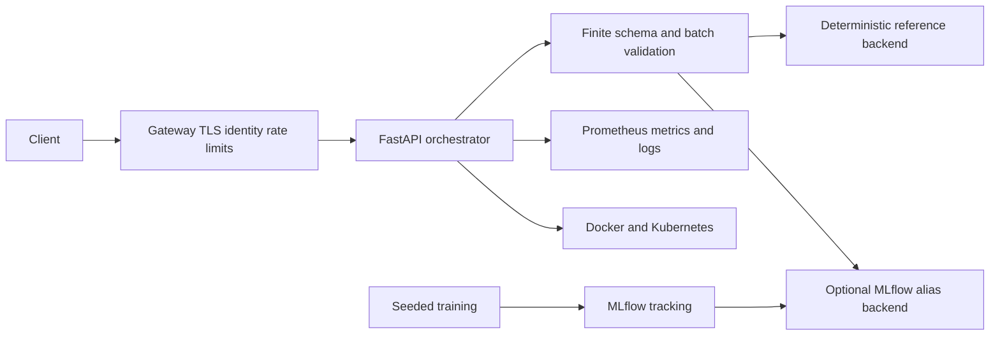

# Architecture

The deterministic backend makes development, CI, health checks, and rollback independently
reproducible. Production can opt into the MLflow alias backend after its registry, artifact,
credentials, network policy, and availability SLO are provisioned.
